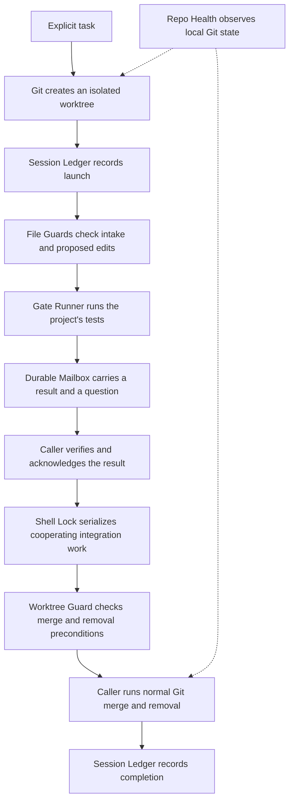

# One work-and-review loop

Run `make demo` from the examples repository after checking out its sibling tools.
Every write and process in the demo belongs to a disposable fixture.

Gate Runner identifies an execution using the repository state and declared command
inputs. Repeating the same request can join or reuse that execution. A failure
remains a failure even when its output contains reassuring words.

The mailbox retains messages and has an explicit acknowledgment path for questions.
Receiving output does not by itself prove the receiving application processed it.
The demo keeps delivery, acknowledgment, and completion as separate operations.

The guard reports a point-in-time Git predicate; the caller performs the actual
Git operation. Holding Shell Lock around both steps coordinates participants
that use the same lock. It does not exclude an editor or process that ignores it.

Separate recipes show configuration inventory comparison, cooperative job
heartbeats, byte-bound review receipts, and decision/question history. A matching
review receipt does not approve its files; an answered question can retain a
refusal. These records can be added to a larger workflow without changing the
core demo. See the [recipe guide](../getting-started/recipes.md).
